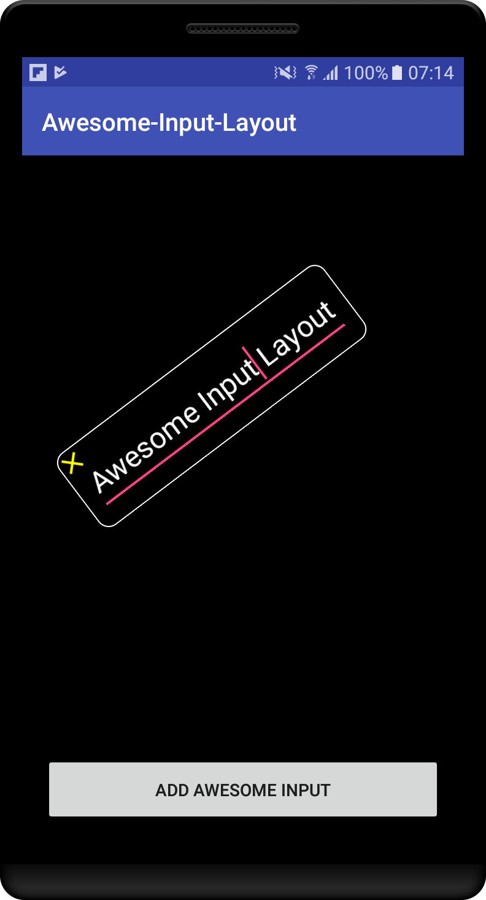

# Awesome-Input-Layout
Awesome Input Layout is an android library to display layout with EditText that can be rotated, autofit, zoom, delete within the app.

[](https://jitpack.io/#hantrungkien/Awesome-Input-Layout)

<a></a>

### install:

**via JitPack (to get current code)**

project/build.gradle
````gradle
allprojects {
    repositories {
        maven { url "https://jitpack.io" }
    }
}
````
module/build.gradle
````gradle
implementation 'com.github.hantrungkien:Awesome-Input-Layout:1.0.0'
````

#### How to use please review in the demo app

### Contribution

If you've found an error, please file an issue.

Patches and new samples are encouraged, and may be submitted by forking this project and submitting a pull request through GitHub.
